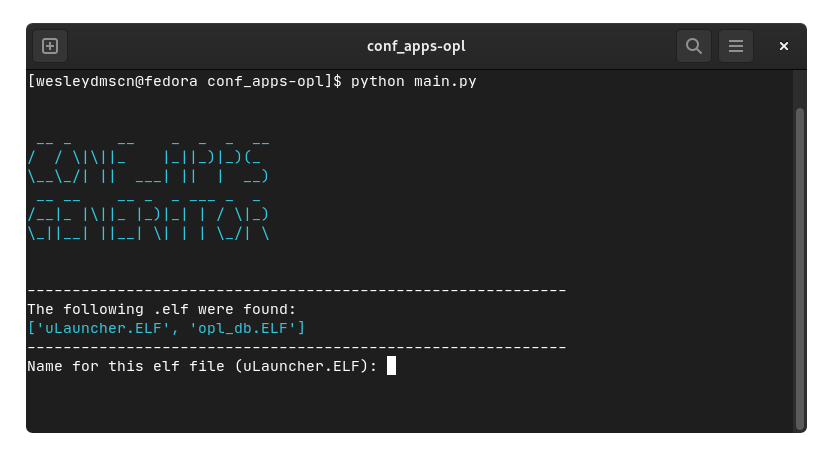

<div align="center">
  
  <p align="center">Configuration file generator conf_apps for Playstation 2 OPL.</p>
  <p align="center">
    <a href="#project">Project</a> · 
    <a href="#installation">Installation</a> · 
    <a href="#docs">Docs</a> · 
    <a href="#contribution">Contribution</a>
  </p>
</div>

## Project
**conf_apps-opl** is a 100% open source scripting tool for the **PS2** unit for the purpose of automating application listing. There are already some options to do this, but most are limited to working only in Windows. It is being developed in the Python language and the premise is that it is **cross-platform**, hence the choice of this language. In this first release, functionality is limited to just **.elf** apps in the **APPS/** folder, support for automating PS1 game listing will be added in the future.

<div align="center">
  
</div>

## Installation
In order for you to be able to use this script successfully, you need to have **python installed** on your machine. Just below is the download link on the website according to your system:

> [**Download the latest version of Python**](https://www.python.org/downloads/)

Right after installing python on your machine, just download the latest version of the script here in this repository, or click on [this link](https://github.com/wesleydmscn/conf_apps-opl/releases) to go straight to the github releases page.

After downloading, extract the `**.zip**` file (do not extract into a separate folder) into a folder containing the **APPS/** folder with your `**.elf**` to list and make sure if if the files are in the same **APPS/** folder, if yes then follow the commands:

> **Note**
> Linux Users:<br>
  Open the folder where the extracted file is located in your terminal and run the following command to create **conf_apps.cfg**:
  ```bash
  $ python main.py
  ```

> **Note**
> Windows Users:<br>
  Open the folder where the extracted file is located in your cmd or powershell and run the following command to create **conf_apps.cfg**:
  ```bash
  $ python main.py
  ```

After running this command, the script should be able to identify whether there is an **APPS/** folder and whether there are files with the `**.elf**` extension inside it to create the `**.cfg**` file.

## Docs

## Contribution